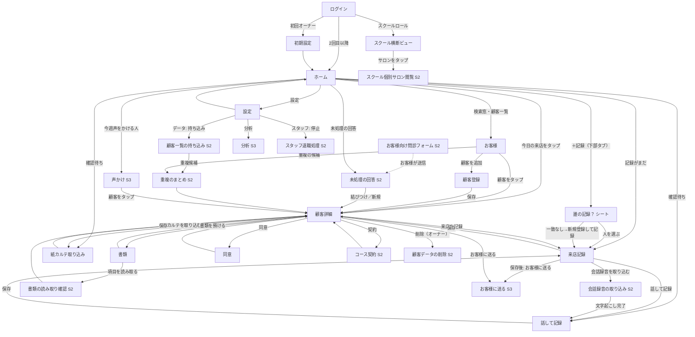

# 仕様書（基本設計）: salon-karte

> Vモデル: 基本設計 / 対応する検証: 結合テスト
> 要件（②）を画面に落とし込む。画面構成・画面ごとの機能・モックHTMLを定義する。
> モックは全画面を1つにまとめた [mocks/mockup.html](./mocks/mockup.html) に作成する（画面ID `#SCR-xx` で各画面へアンカー移動）。
> 状態: **仮（2026-10-07）**。対象は要件定義書の **全スコープ（Scope 1〜3・30機能）**。Scope 1 は SCR-01〜13、Scope 2・3 は SCR-14〜26。友人ヒアリング（2026-10-08）・事業計画書・スプレッドシートの受領後に見直す。ヒアリングで動く箇所には「（仮）」を付した。
> 改訂（2026-10-08・第3版）: 「SaaS として30点・構成が単調」の評価を受け、画面（CRUD）起点から **瞬間起点**（施術前の30秒・施術後の1分・閉店後の5分）に設計を組み替えた。ログインはパスワード方式に変更。まず SCR-01・03・06・07 に適用し、残りの画面は合意後に展開する。
> 手順上の注記: 構造モック（ワイヤーフレーム）とデザイン適用を1回で行った。デザイン案は3案を §3 に併記し、推奨案（A）を適用済み。別案への差し替えは `:root` の値の入れ替えだけで済む。

## 0. 画面設計の方針

- **スマホ幅 375px を基準に設計し、タブレット・PC でも同じ画面がそのまま使える**（1つの Web 画面。端末別の別画面は作らない）。**スマホ向けはストア配布の専用アプリ（ネイティブの殻に同じ画面を載せる）を標準の配布形態とする**（2026-10-08 確定）。殻が録音のバックグラウンド継続・カメラ・プッシュ通知を担い、画面はそのまま。片手・親指で届く下部に主要アクションを置く
- **レスポンシブの方針（3段階）**

| 幅 | 想定端末 | レイアウト |
|---|---|---|
| 〜767px | スマホ（主） | 1カラム。主要アクションは下部固定。本書のモックの基準 |
| 768〜1023px | タブレット（店の共有端末・施術室の iPad） | 本文を最大幅 640px で中央に置き、余白を広げる。ホーム・顧客一覧は2列のカードにしてよい。お客様向けの同意画面（SCR-11）は端末を渡す前提でこの幅を最も重視する |
| 1024px〜 | PC（オーナーの事務作業・スクール） | 左に顧客一覧または設定のメニュー、右に詳細の2カラム。入力画面は最大幅 640px を維持し横に伸ばさない。SCR-13 はこの幅を基準に設計する |

- どの幅でもタップ領域 44px・入力欄 48px・primary ボタン 52px のサイズは変えない（PC でもタブレットと同じ指での操作を想定する）
- モックの左ナビにある「表示幅」でスマホ／タブレット／PC の3段階を切り替えて確認できる
- **設計の軸は画面ではなく「瞬間」**。利用者の1日にある3つの瞬間から逆算する

| 瞬間 | 利用者がしたいこと | 画面の答え |
|---|---|---|
| 施術前の30秒 | 次の人の注意点と警告を、開かずに知りたい | ホームの「次のお客様」ヒーローカードに注意点と警告を直接出す |
| 施術後の1分 | 手を止めずに記録を残したい | 来店記録は「確認 → 記録 → 次回」の3ステップ。最初に大きな「話す」、入力欄は後ろ |
| 閉店後の5分 | 今日の分が全部残ったか確かめたい | ホームの「今日の記録 n / m 人」リングと「あとで」の一覧。完了画面でも進みを見せる |

- **原則5つ**: 今やることを1つだけ大きく／進捗が見える／人を主語にする（顧客詳細は「この人カード」から）／記録は会話のように／迷わない足場（スマホは下部タブ、サブ画面は階層行）。視覚のリズムはヒーロー・タイムライン・リング・グリッド・リストを使い分け、全部をリストにしない
- **アプリの入口はホーム（SCR-03）**。顧客一覧ではなく「今日の来店・記録がまだ・確認待ち」から日常の操作に入る。検索窓はホームと顧客一覧の上部に常設し、絞り込み条件は置かない
- **入口が違っても出口は同じ**。紙取り込み（SCR-08）と音声メモ（SCR-09）は、どちらも「候補を確認して来店記録に保存する」同じ確認画面の構造を持つ
- **情報階層は3段で固定し、全画面の上部に「階層行」を常設する。** 利用者が「今どこにいるか」を見失わないための規則で、戻るボタンの代わりではなく併設する

```
ホーム
├─ お客様（一覧・検索）
│   ├─ 重複のまとめ（S2）
│   └─ ○○さん（顧客詳細）
│        ├─ 来店記録 ── 話して記録 ／ 会話録音の取り込み（S2）
│        ├─ 紙カルテ取り込み
│        ├─ 書類 ── 読み取り確認（S2）
│        ├─ 同意
│        ├─ 契約（S2）
│        ├─ お客様に送る（S3）
│        └─ 削除（S2・オーナー）
├─ 未処理の回答（S2）
├─ 声かけ（S3）
└─ 設定 ── 持ち込み（S2）／ 分析（S3）／ 退職処理（S2）
お客様向け問診フォーム（S2・公開・階層外）
スクール ── 生徒サロンの状況 ── 個別サロン（S2）
```

  - 階層行は画面タイトルの上に小さく置き、「今日 › お客様 › みさき」のように親の経路を示す（ホームの名は「今日」）。現在地は太字にせず色だけ変え、親はタップで戻れる
  - 顧客配下の画面（来店記録・取り込み・書類・同意）は、階層行に必ず顧客名を含める。共有端末で「誰の記録を開いているか」を間違えないため
  - 階層行は3段まで。4段目が必要になる画面は作らない（画面を増やす代わりに、同じ画面内のステップ表示で吸収する）。顧客配下の4段目相当（話して記録・読み取り確認など）は、先頭の「ホーム」を省いて「○○さん › 来店記録 › 話して記録」の3段で表す
  - タブレット・PC では階層行の各段がリンクとして機能する。スマホでは戻るボタンとの併用になる
- **塗りボタン（primary）は1画面に1つ**。その画面で最も進めたい操作だけを塗る
- **3状態（空・ローディング・エラー）を全画面に持つ**。空状態は次の行動へ誘導する文言にする
- **Scope 1 の画面数は 14**（SCR-01〜13 と SCR-27 のシート）。前回の実測上限（14枚）ちょうど。**Scope 2・3 は 13 画面（SCR-14〜26）を追加**し、既存画面には拡張ブロック（顧客詳細の契約・次回提案候補、ホームの未処理回答、来店記録のコース消化・会話録音、設定の追加タブ）を足す。Scope 2 以降の画面はサイトマップに「S2」「S3」と明記し、初版の実装対象から外す

## 1. 画面構成（サイトマップ）

| 画面ID | 画面名 | 目的 | 対応機能(②) | モック |
|--------|-------|------|-------------|-------|
| SCR-01 | ログイン | メールアドレス＋パスワードで入る。端末記憶・再設定リンク | FUNC-02 | [mockup.html#SCR-01](./mocks/mockup.html#SCR-01) |
| SCR-02 | 初期設定 | サロン名・業種・使っている入口／ツールの申告・スタッフ招待を最短で済ませる | FUNC-01, FUNC-05 | [mockup.html#SCR-02](./mocks/mockup.html#SCR-02) |
| SCR-03 | ホーム（今日） | 「次のお客様」ヒーロー・今日の記録リング・タイムライン（次回予約・今日の記録・手で足した人のみ）・あとで。アプリの入口 | FUNC-29, FUNC-03, FUNC-06, FUNC-31 | [mockup.html#SCR-03](./mocks/mockup.html#SCR-03) |
| SCR-04 | お客様（一覧・検索） | 検索窓1つで顧客を探す。最近来店順の一覧 | FUNC-03 | [mockup.html#SCR-04](./mocks/mockup.html#SCR-04) |
| SCR-05 | 顧客登録 | 呼び名（必須）と本名の姓・名（任意・別データ）。重複候補を知らせる | FUNC-03 | [mockup.html#SCR-05](./mocks/mockup.html#SCR-05) |
| SCR-06 | 顧客詳細（この人カード） | モノグラム・来店のリズム・3つの数字・警告・注意点。記録／写真／書類／契約／同意のタブ。シグネチャ（金のヘアラインと明朝の帯） | FUNC-03, FUNC-06, FUNC-07, FUNC-09, FUNC-15 | [mockup.html#SCR-06](./mocks/mockup.html#SCR-06) |
| SCR-07 | 来店記録（3ステップ） | 確認 → 記録 → 次回。最初に「話す」、入力欄は後ろ。完了画面で今日の進み | FUNC-04, FUNC-05, FUNC-07 | [mockup.html#SCR-07](./mocks/mockup.html#SCR-07) |
| SCR-08 | 紙カルテ取り込み | 撮影 → 抽出候補を元画像と並べて確認 → 来店ごとに保存 | FUNC-08, FUNC-25 | [mockup.html#SCR-08](./mocks/mockup.html#SCR-08) |
| SCR-09 | 話して記録（音声メモ） | 録音 → 文字起こしと項目候補を確認 → 来店記録に保存 | FUNC-13, FUNC-25 | [mockup.html#SCR-09](./mocks/mockup.html#SCR-09) |
| SCR-10 | 書類 | PDF／写真を顧客に紐づけて預け、種類と日付を付ける。原本を開く | FUNC-09 | [mockup.html#SCR-10](./mocks/mockup.html#SCR-10) |
| SCR-11 | 同意 | 同意の一覧と、お客様に見せてタップ／サインしてもらう電子同意 | FUNC-15 | [mockup.html#SCR-11](./mocks/mockup.html#SCR-11) |
| SCR-12 | 設定 | AI 利用・カルテ項目・スタッフ・データ（顧客・来店の CSV ダウンロード）・サロン情報 | FUNC-05, FUNC-02, FUNC-25, FUNC-01, FUNC-30 | [mockup.html#SCR-12](./mocks/mockup.html#SCR-12) |
| SCR-13 | スクール横断ビュー | 生徒サロンの定着状況・入口構成・AI 利用量を横断で見る（スクールロール専用） | FUNC-23 | [mockup.html#SCR-13](./mocks/mockup.html#SCR-13) |
| SCR-27 | 誰の記録ですか？（シート） | 下部タブ「＋記録」で開く。賢い既定・今日来る人・検索・最近来た方・新規登録を1枚に。記録かお客様追加かを先に選ばせない | FUNC-04, FUNC-03 | [mockup.html#SCR-27](./mocks/mockup.html#SCR-27) |
| SCR-14 | お客様向け問診フォーム（S2） | **お客様のスマホで開く公開 Web ページ（アプリ外・ログイン不要）**。LINE のリンクや店頭 QR から。来店時はサロンのタブレットを渡してもよい | FUNC-10, FUNC-15, FUNC-27 | [mockup.html#SCR-14](./mocks/mockup.html#SCR-14) |
| SCR-15 | 未処理の回答（S2） | フォーム回答を既存顧客に結びつける、または新規作成する | FUNC-10, FUNC-12 | [mockup.html#SCR-15](./mocks/mockup.html#SCR-15) |
| SCR-16 | 顧客一覧の持ち込み（S2） | 予約サイト等の CSV を列対応を確認して取り込む。全件成功か全件取り消し | FUNC-11 | [mockup.html#SCR-16](./mocks/mockup.html#SCR-16) |
| SCR-17 | 重複のまとめ（S2） | 2人分を合わせて1人に。記録は全部残し、属性は項目ごとに選ぶ | FUNC-12 | [mockup.html#SCR-17](./mocks/mockup.html#SCR-17) |
| SCR-18 | 会話録音（S2） | Web 版は録音アプリのファイルを取り込み、アプリ版はこの画面で録音。見込み費用を確認して文字起こしへ。出口は SCR-09 | FUNC-14, FUNC-25 | [mockup.html#SCR-18](./mocks/mockup.html#SCR-18) |
| SCR-19 | 書類の読み取り確認（S2） | 預かった書類から抽出した項目を既存値と並べて確認し、顧客情報・同意・契約に反映 | FUNC-28, FUNC-03, FUNC-15, FUNC-22 | [mockup.html#SCR-19](./mocks/mockup.html#SCR-19) |
| SCR-20 | コース契約（S2） | 回数制・期間制の契約を登録し、残回数・有効期限・原本を見る | FUNC-22, FUNC-09 | [mockup.html#SCR-20](./mocks/mockup.html#SCR-20) |
| SCR-21 | お客様に送る（S3） | 来店記録から「今日の内容と次回のおすすめ」の文面を確認し、コピーまたは LINE で送る | FUNC-20, FUNC-27, FUNC-15 | [mockup.html#SCR-21](./mocks/mockup.html#SCR-21) |
| SCR-22 | 声かけ（S3） | メニューの周期から「今週声をかける人」を根拠つきで並べ、声かけ済みにする | FUNC-19, FUNC-26, FUNC-27 | [mockup.html#SCR-22](./mocks/mockup.html#SCR-22) |
| SCR-23 | 分析（S3） | 周期内再来率・成約率・客単価・次回予約率・メニュー別・来店経路別と、根拠つきの改善点候補 | FUNC-21 | [mockup.html#SCR-23](./mocks/mockup.html#SCR-23) |
| SCR-24 | 顧客データの削除（S2） | 消えるものと保管義務で残るものを示し、確認して実行。オーナー専用 | FUNC-16 | [mockup.html#SCR-24](./mocks/mockup.html#SCR-24) |
| SCR-25 | スタッフ退職処理（S2） | 停止と担当顧客の一括振り直し。オーナー専用 | FUNC-17, FUNC-02 | [mockup.html#SCR-25](./mocks/mockup.html#SCR-25) |
| SCR-26 | スクール個別サロン閲覧（S2） | スクールがそのサロンの集計・記録をすべて見る（閲覧のみ）。閲覧履歴がサロン側に残る | FUNC-24, FUNC-21 | [mockup.html#SCR-26](./mocks/mockup.html#SCR-26) |

**既存画面への拡張ブロック（Scope 2・3）**

| 画面 | 追加するブロック | 対応機能(②) |
|---|---|---|
| SCR-03 ホーム | 「未処理の回答」段（件数つき）→ SCR-15。「今週声をかける人」の件数 → SCR-22 | FUNC-10, FUNC-19 |
| SCR-06 顧客詳細 | 「契約」ブロック（残回数・有効期限）→ SCR-20。「今回気をつけること」に AI 候補（候補バッジ・根拠リンク・確定）。アクションに「お客様に送る」→ SCR-21、「削除」（オーナーのみ）→ SCR-24 | FUNC-22, FUNC-18, FUNC-20, FUNC-16 |
| SCR-07 来店記録 | 「このコースを消化」の選択。入口ボタンに「会話録音を取り込む」→ SCR-18。メニューはマスタから選択（金額・周期が入る） | FUNC-22, FUNC-14, FUNC-26 |
| SCR-10 書類預かり | 各書類に「項目を読み取る」→ SCR-19。書類種別に「概要書面」 | FUNC-28 |
| SCR-12 設定 | 「メニュー」（マスタ・標準価格・周期）、「LINE」（接続・送信数）、「データ」（顧客・来店の CSV ダウンロードは S1、原本一式の持ち出しは S2、担当限定オプション、スクールの閲覧履歴） | FUNC-26, FUNC-27, FUNC-30, FUNC-24, FUNC-02 |
| SCR-13 スクール横断ビュー | サロン行のタップ → SCR-26（閲覧のみ・履歴が残る） | FUNC-24 |

### 画面遷移図



### 共通要素

| 要素 | 内容 | 対応機能(②) |
|---|---|---|
| 下部タブ（スマホ） | 最上位の5つ: 今日（ホーム）・お客様・＋記録（中央・浮かせる。SCR-27 のシートを開く）・声かけ（S3。Scope 1 では薄く表示し、実装は4タブ相当）・設定。最上位画面（SCR-03・04・12・22）にだけ出す。サブ画面では戻る＋階層行に切り替わる | FUNC-29, 03, 04, 19 |
| 上部バー | 2段構成。上段に**階層行**（今日 › お客様 › ○○さん）、下段に戻るボタンと画面タイトル。最上位画面では階層行は1段のみ | - |
| 階層行 | 全画面に常設。親はタップで戻れる。顧客配下の画面は顧客名を必ず含む。3段まで | - |
| 敬称 | 既定は「様」。名前を大きく出す場所（ヒーロー・この人カード・シートの既定）だけ、名前の後ろに小さく薄い字で添える。タイムライン・一覧・表などの密な行では敬称を省き名前だけにする。お客様に見せる文面（送付・同意画面）は通常サイズの「様」。サロン設定で「様／さん／なし」を選べる（FUNC-01） | FUNC-01 |
| 検索窓 | ホームと顧客一覧の上部。名前・ふりがな・電話番号の部分一致。入力のたびに絞り込む。条件選択は無い | FUNC-03 |
| 施術者切替 | 来店記録の先頭。現在の操作者が既定。タップで店のスタッフ一覧から選ぶ（共有端末対応） | FUNC-04 |
| 候補の表示 | AI が入れた値は「候補」バッジ付きの入力欄。確定前は保存されない | FUNC-08, 13 |
| 3状態 | 空状態は「まだ○○がありません。＋で追加」の形。ローディングはスケルトン。エラーは原因と直し方を1文ずつ | 全画面 |
| 警告 | 禁忌由来の警告は error 色の帯。画面上部に固定し、人が消せない | FUNC-06 |

## 2. 画面ごとの仕様

### SCR-01 ログイン

**目的**: メールアドレスとパスワードで入る。「この端末を記憶する」で30日は再入力不要。忘れたらメールで再設定。

**UI要素**

| 要素 | 説明 | 位置 | 対応機能(②) |
|------|------|------|-------------|
| サービス名・挨拶 | 「おかえりなさい」。明朝・字間広め | 上部 | - |
| メールアドレス | ラベル常時表示・下線入力 | 中央 | FUNC-02 |
| パスワード | 伏せ字。「表示」で切替 | 中央 | FUNC-02 |
| この端末を記憶する | トグル。既定オン | パスワードの下 | FUNC-02 |
| ログイン（primary） | | トグルの下 | FUNC-02 |
| 補助リンク | 「パスワードを忘れた」「招待リンクから始める」 | 下部・小さく | FUNC-02, 01 |

**操作とインタラクション**

| 操作 | UI要素 | 挙動 | 対応機能(②) |
|------|--------|------|-------------|
| 入力してログイン | primary | 初回オーナーは SCR-02、それ以外は SCR-03、スクールロールは SCR-13 へ | FUNC-02 |
| パスワードを忘れた | リンク | メールアドレスに再設定リンクを送る（30分有効） | FUNC-02 |
| 端末を記憶する | トグル | 30日のスライド更新。共有端末ではオフを推奨する注記 | FUNC-02 |

**エラー・例外表示**

| ケース | トリガー | 画面の挙動・表示 | 対応する要件(②) |
|--------|---------|----------------|----------------|
| 不一致 | ログイン | パスワード欄の下に「メールアドレスかパスワードが違います。忘れた場合は下のリンクから再設定できます」。どちらが違うかは言わない | FUNC-02 |
| 連続5回失敗 | ログイン | 「しばらく時間をおいてください。10分間ログインできません」 | FUNC-02 |
| 停止済み | ログイン | 「このアカウントは利用できません。サロンのオーナーに確認してください」 | FUNC-02 |
| 再設定リンク期限切れ | リンクを開く | 「リンクの有効期限が切れました。もう一度送ってください」 | FUNC-02 |

**モック**: [mockup.html#SCR-01](./mocks/mockup.html#SCR-01)
### SCR-02 初期設定

**目的**: 招待されたオーナーが、必須4項目以内でホームに到達する。スクールが伴走する前提。

**UI要素**

| 要素 | 説明 | 位置 | 対応機能(②) |
|------|------|------|-------------|
| 進捗表示 | 「1/3 サロン」「2/3 使っているもの」「3/3 スタッフ」 | 上部 | FUNC-01 |
| サロン名 | 必須。スクールが作ったテナント名が既定で入る | ステップ1 | FUNC-01 |
| 業種（複数可） | フェイシャル・痩身・脱毛・眉毛・ネイル・まつエク。チェック式 | ステップ1 | FUNC-01, 05 |
| 使っている入口／ツール | 予約サイト・LINE フォーム・紙カルテ・紙の同意書・その他。チェック式 | ステップ2 | FUNC-01 |
| スタッフ招待 | 連絡先を1行ずつ。任意。「あとで」で飛ばせる | ステップ3 | FUNC-01, 02 |
| 進むボタン（primary） | 「次へ」→ 最終ステップで「はじめる」 | 下部固定 | FUNC-01 |

**操作とインタラクション**

| 操作 | UI要素 | 挙動 | 対応機能(②) |
|------|--------|------|-------------|
| 業種を選ぶ | 業種チェック | 選んだ業種のメニュー種別テンプレートが用意される（SCR-12 で確認できる） | FUNC-05 |
| 入口を申告 | 入口チェック | サロン詳細に保存され、SCR-13 の集計に反映 | FUNC-01, 23 |
| はじめる | 進むボタン | SCR-03 ホームへ。空状態の案内が出る | FUNC-01, 29 |

**エラー・例外表示**

| ケース | トリガー | 画面の挙動・表示 | 対応する要件(②) |
|--------|---------|----------------|----------------|
| サロン名が空 | 次へ | 入力欄の下に「サロン名を入力してください」 | FUNC-01 |
| 業種が未選択 | 次へ | 「1つ以上選んでください。あとから足せます」 | FUNC-01 |
| 招待の連絡先が不正 | はじめる | 該当行に「形式を確認してください」。他の行は送る | FUNC-02 |

**モック**: [mockup.html#SCR-02](./mocks/mockup.html#SCR-02)

### SCR-03 ホーム（今日）

**目的**: 「次のお客様」を主役にして施術前の30秒を済ませ、今日の記録の進みを見せる。アプリの入口。

**UI要素**

| 要素 | 説明 | 位置 | 対応機能(②) |
|------|------|------|-------------|
| 日付 | 「10月8日 水曜日」だけ。挨拶や名前は出さない（共有端末で誰のログインかが曖昧になり、最上部2行を消費するため。2026-10-08 判断） | 最上部 | FUNC-29 |
| 検索窓 | 名前か電話番号。入力で SCR-04 の結果に | 挨拶の下 | FUNC-03 |
| 次のお客様（ヒーロー） | 深い地色のカード。**3状態のどれか1枚だけ**: 施術前（来店を確認する）／施術中（記録を残す・話して記録）／全員記録済み（完了）。名前（大）・時刻と残り時間・来店回数・メニュー・前回日・**今回気をつけること**・**安全上の警告**・「記録を始める」（primary）「この方を見る」 | 1段目 | FUNC-29, 06, 04 |
| 今日の記録リング | 「2 / 5 人 記録済み」のリングと一言 | 2段目 | FUNC-29, 04 |
| 今日の流れ（タイムライン） | 時刻順。済・次・未の点。各行は名前の下に **「新規」または「n回目」を先頭に**、メニュー・前回日・間隔（久しぶりなら）・記録状態。新規は「新規」バッジ、体験・警告もバッジ。データ源（次回予約日・今日の記録・手で足した人）は画面には書かない（利用者には不要な実装の事情）。末尾に「今日来る人を足す」 | 3段目 | FUNC-29, 04 |
| 今日来る人を足す | 顧客を検索して選ぶだけ（時刻は任意）。予約サイト・DM・電話の予約はここから。外部の予定の自動取り込みは S3（FUNC-31） | タイムライン末尾 | FUNC-29, 31 |
| あとで | 記録がまだ・確認待ち・未処理の回答（S2）。件数つき | 4段目 | FUNC-29, 08, 13, 10 |
| 下部タブ | 今日・お客様・＋記録・声かけ（S3）・設定 | 下部固定 | FUNC-29 |

**操作とインタラクション**

| 操作 | UI要素 | 挙動 | 対応機能(②) |
|------|--------|------|-------------|
| 記録を始める | ヒーローの primary | その顧客の SCR-07 ステップ1へ | FUNC-04 |
| この方を見る | ヒーローのリンク | SCR-06 へ | FUNC-03 |
| タイムラインの人をタップ | 行 | SCR-06 へ。済の人は直近の来店記録へ | FUNC-03, 04 |
| ＋記録 | 下部タブ中央 | 顧客を選んで SCR-07 へ | FUNC-04 |
| あとでの行 | 行 | SCR-07（続き）／SCR-08・09（確認）／SCR-15 へ | FUNC-04, 08, 13, 10 |

**エラー・例外表示**

| ケース | トリガー | 画面の挙動・表示 | 対応する要件(②) |
|--------|---------|----------------|----------------|
| 顧客0人（初回） | 表示 | ヒーローの代わりに「はじめの3歩」（最初のお客様を登録／紙を1枚撮る／今日の来店を1件話して残す）。primary は1つ。「予約はこれまでどおり予約サイトや LINE で。ここには今日来る人を足すだけ」の説明はこの初回状態にだけ出す | FUNC-03, 08, 13 |
| 今日の来店なし | 表示 | ヒーローに「今日の予定はまだ入っていません」と「今日来る人を足す」「記録を始める」 | FUNC-29 |
| 外部の予定の候補（S3） | 表示 | Google カレンダー／予約通知メール由来の予定は「候補」バッジで出て、顧客に結びつけると通常の行になる | FUNC-31 |
| 次の人に警告 | 表示 | ヒーロー内に警告チップ。タイムラインにも警告バッジ | FUNC-06 |
| 記録がまだが7日超 | 表示 | 一覧から消え、件数バッジだけ残す | FUNC-29 |
| AI 上限到達 | 表示 | あとでの下に「今月の AI 利用が上限」 | FUNC-25 |
| 取得失敗 | 表示 | 「読み込めませんでした。電波を確認して引き下げて更新」 | - |

**モック**: [mockup.html#SCR-03](./mocks/mockup.html#SCR-03)
### SCR-04 お客様（一覧・検索）

**目的**: 検索窓1つで顧客にたどり着く。条件は選ばせない。

**UI要素**

| 要素 | 説明 | 位置 | 対応機能(②) |
|------|------|------|-------------|
| 検索窓 | ホームと同じ。フォーカス状態で開く | 最上部 | FUNC-03 |
| 顧客行 | 呼び名・ふりがな・最終来店日・警告の有無・次回予約日 | 一覧 | FUNC-03, 06 |
| 件数 | 「○人」 | 一覧の上 | FUNC-03 |
| 顧客を追加（primary） | SCR-05 へ | 下部固定 | FUNC-03 |

**操作とインタラクション**

| 操作 | UI要素 | 挙動 | 対応機能(②) |
|------|--------|------|-------------|
| 文字を入力 | 検索窓 | 1文字ごとに名前・ふりがな・電話番号の部分一致で絞り込む（1秒以内） | FUNC-03 |
| 顧客をタップ | 顧客行 | SCR-06 へ | FUNC-03 |
| 顧客を追加 | primary | SCR-05 へ。検索窓の文字列を呼び名の初期値にする | FUNC-03 |

**エラー・例外表示**

| ケース | トリガー | 画面の挙動・表示 | 対応する要件(②) |
|--------|---------|----------------|----------------|
| 一致なし | 検索 | 「『○○』に一致するお客様はいません」と、その文字列で登録する primary | FUNC-03 |
| 顧客0人 | 表示 | 「まだお客様が登録されていません」と登録・取り込みへの導線 | FUNC-03, 08 |

**モック**: [mockup.html#SCR-04](./mocks/mockup.html#SCR-04)

### SCR-05 顧客登録

**目的**: 呼び名だけで3タップ以内に登録する。本名の姓・名は任意で、別のデータとして持つ。重複を知らせる。

**UI要素**

| 要素 | 説明 | 位置 | 対応機能(②) |
|------|------|------|-------------|
| 問い | 「お客様をなんと呼んでいますか」。明朝・大きく | 上部 | FUNC-03 |
| 呼び名 | 必須。大きな入力欄。敬称は付けない（表示時に自動） | 問いの下 | FUNC-03 |
| 本名（任意） | 姓・名・せい・めい の4欄。用途の説明（書面の宛名・メッセージの宛名）。名を入れると呼び名の候補になる | 呼び名の下・カード | FUNC-03 |
| 連絡先など（折りたたみ） | 電話番号・LINE 表示名・生年月日・初回来店日 | 本名の下・閉じた状態 | FUNC-03 |
| 重複候補 | 電話番号一致時に、既存顧客のカード（呼び名・本名・最終来店・回数）と「このお客様を開く／別の人」 | 連絡先の下 | FUNC-03, 12 |
| 登録する（primary） | | 下部固定 | FUNC-03 |

**操作とインタラクション**

| 操作 | UI要素 | 挙動 | 対応機能(②) |
|------|--------|------|-------------|
| 呼び名を入れて登録 | primary | 顧客を作り SCR-06 へ | FUNC-03 |
| 名を入力 | 本名・名 | 呼び名が空なら候補として自動で入る（上書きはしない） | FUNC-03 |
| 重複候補を開く | 候補カード | 新規登録をやめ、既存顧客の SCR-06 へ | FUNC-03 |

**エラー・例外表示**

| ケース | トリガー | 画面の挙動・表示 | 対応する要件(②) |
|--------|---------|----------------|----------------|
| 呼び名が空 | 登録 | 「呼び名を入力してください」 | FUNC-03 |
| 電話番号一致 | 入力中 | 重複候補を表示。登録は止めない | FUNC-03 |
| 姓だけ・名だけ | 登録 | 片方だけでも保存できる（宛名は入っている方を使う） | FUNC-03 |
| 初回来店日が未来 | 登録 | 「初回来店日は今日以前の日付にしてください」 | FUNC-03 |

**モック**: [mockup.html#SCR-05](./mocks/mockup.html#SCR-05)

### SCR-06 顧客詳細（この人カード）

**目的**: 人を主語に、この人の「いま」を1画面目で把握する。記録・写真・書類・契約・同意はタブで分け、縦に長く並べない。

**UI要素**

| 要素 | 説明 | 位置 | 対応機能(②) |
|------|------|------|-------------|
| この人カード | モノグラム（頭文字）・呼び名（大・明朝・小さな敬称）・本名とふりがな（小）・初回来店月・**来店のリズム**（来店を点で並べ、次回は白抜き） | 最上部 | FUNC-03 |
| 3つの数字 | 来店回数・周期（日）・次回予約日 | カードの下・罫線で区切る | FUNC-03, 04, 26 |
| 安全上の警告 | 禁忌がある場合のみ。ボルドーの縦線 | 数字の下 | FUNC-06, 03 |
| 今回気をつけること | 金の縦線＋明朝。人が確定した注意点 | 警告の下 | FUNC-06 |
| 次回提案の候補（S2） | 候補バッジ・根拠リンク・確定 | 注意点の下 | FUNC-18 |
| タブ | 記録／写真／書類／契約（S2）／同意 | 中央 | - |
| 記録タブ | 来店記録の時系列（紙由来はバッジ）＋「紙カルテを取り込む」「お客様に送る（S3）」 | タブ内 | FUNC-04, 08, 20 |
| 写真タブ | 施術後写真の3列グリッド（時系列）。タップで前後比較 | タブ内 | FUNC-07 |
| 書類タブ | 預かり書類の一覧＋「書類を預ける」 | タブ内 | FUNC-09 |
| 契約タブ（S2） | 残回数（大）・有効期限・進捗バー → SCR-20 | タブ内 | FUNC-22 |
| 同意タブ | 4種の取得状況＋「画面で同意をもらう」。最下部に削除（S2・オーナー） | タブ内 | FUNC-15, 16 |
| この方の来店を記録（primary） | | 下部固定 | FUNC-04 |

**操作とインタラクション**

| 操作 | UI要素 | 挙動 | 対応機能(②) |
|------|--------|------|-------------|
| 来店を記録 | primary | SCR-07 ステップ1へ（顧客確定） | FUNC-04 |
| タブ切替 | タブ | 内容だけ入れ替わる。この人カード・警告・注意点は固定 | - |
| 注意点を編集 | 注意点 | その場で編集・確定 | FUNC-06 |
| 写真をタップ | グリッド | 前後比較の拡大表示 | FUNC-07 |
| リズムの点をタップ | 来店のリズム | その来店記録へ | FUNC-04 |

**エラー・例外表示**

| ケース | トリガー | 画面の挙動・表示 | 対応する要件(②) |
|--------|---------|----------------|----------------|
| 来店記録0件 | 表示 | リズムは点なし。記録タブに「まだ来店の記録がありません」と取り込み導線 | FUNC-04, 08 |
| 写真同意未取得 | 写真を撮ろうとする | 「写真の同意がまだです。お客様に確認しますか」→ SCR-11 | FUNC-07, 15 |
| 原本 URL 期限切れ | 書類タップ | 再取得。失敗時「もう一度お試しください」 | FUNC-09 |
| 別サロンの顧客 ID | 直接アクセス | 「このお客様は見つかりません」 | FUNC-02 |

**モック**: [mockup.html#SCR-06](./mocks/mockup.html#SCR-06)
### SCR-07 来店記録（確認 → 記録 → 次回）

**目的**: 長いフォームではなく3ステップの会話で、施術後の1分で残す。最初に「話す」、入力欄は後ろ。終わりに進みを見せる。

**UI要素**

| 要素 | 説明 | 位置 | 対応機能(②) |
|------|------|------|-------------|
| 上部 | 顧客名・来店日・施術者（タップで切替）・「あとで」 | 上部バー | FUNC-04 |
| ステップ表示 | 1 確認 → 2 記録 → 3 次回 | バーの下 | FUNC-04 |
| ステップ1 確認 | 本日の禁忌チェック・来店種別（体験は仮）・メニュー・コース消化（S2）・前回の申し送り | ステップ1 | FUNC-04, 03, 22 |
| ステップ2 記録 | 大きな「話す」（SCR-09）、写真を撮る、録音を取り込む（S2）。その下に「または直接入力する」の区切りと「話さなくても大丈夫です。欄をタップしてそのまま書けます」の一文、続けてテンプレート項目（AI を使えば候補バッジ付き、使わなければ空欄で直接入力）・写真サムネ。**手入力は常に使える基本の入口で、「話す」はその上に乗る省力手段** | ステップ2 | FUNC-13, 07, 14, 05 |
| ステップ3 次回 | 次回への申し送り（候補）・次回予約日・金額（任意）・来店経路 | ステップ3 | FUNC-04, 06 |
| 完了 | 「記録が残りました」と今日のリング（3/5）、「お客様に送る（S3）」「今日に戻る」 | 保存後 | FUNC-04, 29, 20 |
| 進むボタン（primary） | 「確認しました。記録へ」→「次へ（3 次回）」→「保存する」 | 下部固定 | FUNC-04 |

**操作とインタラクション**

| 操作 | UI要素 | 挙動 | 対応機能(②) |
|------|--------|------|-------------|
| 話す | 円ボタン | SCR-09 へ。戻ると候補がステップ2・3の欄に入る | FUNC-13 |
| 写真を撮る | ボタン | カメラ → 前／後ラベル → サムネ | FUNC-07 |
| 候補を確定 | 候補欄 | タップでバッジが消え確定値に | FUNC-08, 13 |
| 次へ／保存 | primary | 保存で完了画面。空欄があっても保存できる | FUNC-04 |
| あとで | 上部リンク | 下書き保存。ホームの「記録がまだ」へ | FUNC-04, 29 |
| ステップを戻る | ステップ表示 | 入力は保持 | FUNC-04 |

**エラー・例外表示**

| ケース | トリガー | 画面の挙動・表示 | 対応する要件(②) |
|--------|---------|----------------|----------------|
| 禁忌チェック未記入 | ステップ1→2 | 「本日の確認がまだです。確認せずに進みますか」。進めはする | FUNC-04 |
| 候補のまま保存 | 保存 | 「候補のままの項目があります。確定して保存／候補を捨てる」 | FUNC-08, 13 |
| 同一日2件目 | 保存 | 「今日はすでに記録があります。別の来店として保存しますか」 | FUNC-04 |
| 次回予約日が来店日以前 | ステップ3 | 「来店日より後の日付にしてください」 | FUNC-04 |
| 写真20枚超 | 追加 | 「1回の来店に添付できる写真は20枚までです」 | FUNC-07 |
| 電波なし | 写真・音声 | 「送信待ち」。つながったら自動送信 | FUNC-07, 13 |

**モック**: [mockup.html#SCR-07](./mocks/mockup.html#SCR-07)
### SCR-08 紙カルテ取り込み

**目的**: 紙を撮るだけで、元画像と並べて確認し、来店ごとの記録にする。

**UI要素**

| 要素 | 説明 | 位置 | 対応機能(②) |
|------|------|------|-------------|
| ステップ表示 | 「撮影 → 読み取り中 → 確認」 | 上部 | FUNC-08 |
| 撮影エリア | カメラ起動・複数枚。撮った枚数 | ステップ1 | FUNC-08 |
| 読み取り中 | 「読み取っています。閉じてもホームの確認待ちに届きます」 | ステップ2 | FUNC-08, 29 |
| 元画像 | 撮った紙。ピンチで拡大 | ステップ3 上半分 | FUNC-08 |
| 抽出候補 | 来店日ごとにタブ分け。項目ごとに候補バッジ付き欄。読めない箇所は空欄＋「読めませんでした」 | ステップ3 下半分 | FUNC-08, 05 |
| 初回来店日の候補 | 最も古い来店日を提案 | 候補の上 | FUNC-03 |
| 保存（primary） | 「○件の来店として保存」 | 下部固定 | FUNC-08 |

**操作とインタラクション**

| 操作 | UI要素 | 挙動 | 対応機能(②) |
|------|--------|------|-------------|
| 撮影 | 撮影エリア | 複数枚撮り「読み取る」で非同期処理へ | FUNC-08 |
| 来店タブを切替 | 候補タブ | その来店分の候補を表示 | FUNC-08 |
| 候補を直す | 候補欄 | 編集で確定値に | FUNC-08 |
| 保存 | primary | 来店記録を複数件作り、元画像を各記録に紐づけて SCR-06 へ | FUNC-08, 04 |

**エラー・例外表示**

| ケース | トリガー | 画面の挙動・表示 | 対応する要件(②) |
|--------|---------|----------------|----------------|
| AI 上限到達 | 読み取る | 「今月の読み取りは上限に達しました。画像は保存し、上限が戻ったら読み取ります」。元画像だけ保存 | FUNC-25 |
| 日付が読めない | 確認 | 来店日欄が空＋「日付を入力してください」。保存は日付必須 | FUNC-08, 04 |
| 読み取り失敗 | 処理 | 「読み取れませんでした。明るい場所でもう一度撮るか、画像だけ保存できます」 | FUNC-08 |
| 顧客未選択で開始 | 撮影前 | 顧客を検索して選ぶか「新しいお客様として」を選ぶ | FUNC-08, 03 |

**モック**: [mockup.html#SCR-08](./mocks/mockup.html#SCR-08)

### SCR-09 話して記録（音声メモ）

**目的**: 話すだけで項目候補を作り、来店記録に戻す。会話録音（Scope 2）も出口はこの画面。

**UI要素**

| 要素 | 説明 | 位置 | 対応機能(②) |
|------|------|------|-------------|
| 録音ボタン | 大きな1つのボタン。録音中は停止に変わる。経過時間 | 中央 | FUNC-13 |
| 案内 | 「施術の内容・気づいたこと・次回への申し送りを話してください」 | ボタンの上 | FUNC-13 |
| 処理中 | 「文字にしています。閉じてもホームの確認待ちに届きます」 | 停止後 | FUNC-13, 29 |
| 文字起こし全文 | 折りたたみ。自由メモに残すチェック | 確認ステップ上部 | FUNC-13 |
| 項目候補 | 項目ごとに候補バッジ付き欄。聞き取れない箇所は空欄 | 確認ステップ下部 | FUNC-13, 05 |
| 来店記録に戻す（primary） | 「この内容で来店記録へ」 | 下部固定 | FUNC-13 |

**操作とインタラクション**

| 操作 | UI要素 | 挙動 | 対応機能(②) |
|------|--------|------|-------------|
| 録音→停止 | 録音ボタン | 音声を送り、非同期で文字起こしと候補生成 | FUNC-13 |
| 候補を直す | 候補欄 | 編集で確定値に | FUNC-13 |
| 来店記録に戻す | primary | SCR-07 に候補が入った状態で戻る | FUNC-13, 04 |

**エラー・例外表示**

| ケース | トリガー | 画面の挙動・表示 | 対応する要件(②) |
|--------|---------|----------------|----------------|
| マイク許可なし | 録音 | 「マイクの使用を許可してください。端末の設定から変更できます」 | FUNC-13 |
| 10分超 | 録音中 | 10分で自動停止し「ここまでの内容で進めます」 | FUNC-13 |
| AI 上限到達 | 停止 | 「音声は保存しました。読み取りは上限が戻ったら行います」 | FUNC-25 |
| 電波なし | 停止 | 「送信待ち。つながったら自動で文字にします」 | FUNC-13 |
| 聞き取り不能 | 処理 | 候補が全部空。「聞き取れませんでした。静かな場所でもう一度お試しください」 | FUNC-13 |

**モック**: [mockup.html#SCR-09](./mocks/mockup.html#SCR-09)

### SCR-10 書類

**目的**: 契約書・概要書面・同意書・問診票を顧客に紐づけて預け、原本をいつでも開ける。抽出は Scope 2。

**UI要素**

| 要素 | 説明 | 位置 | 対応機能(②) |
|------|------|------|-------------|
| 預かった書類一覧 | 種類・日付・元のファイル名 | 上部 | FUNC-09 |
| ファイル選択／撮影 | 「ファイルを選ぶ」「撮影する」の枠線ボタン | 一覧の下 | FUNC-09 |
| 種類と日付 | 契約書／概要書面／同意書／問診票／その他。日付 | 選択後 | FUNC-09 |
| 同意に紐づける | 同意書のとき「同意の記録を作る」チェック（SCR-11 に反映） | 種類の下 | FUNC-15 |
| 預ける（primary） | 「預ける」 | 下部固定 | FUNC-09 |

**操作とインタラクション**

| 操作 | UI要素 | 挙動 | 対応機能(②) |
|------|--------|------|-------------|
| 書類をタップ | 一覧の行 | 原本を開く | FUNC-09 |
| ファイルを選んで預ける | primary | 保存し一覧に追加。SCR-06 の時系列にも出る | FUNC-09 |
| 同意書として預ける | 同意チェック | 同意記録（紙）を同時に作り、原本に紐づける | FUNC-15 |

**エラー・例外表示**

| ケース | トリガー | 画面の挙動・表示 | 対応する要件(②) |
|--------|---------|----------------|----------------|
| 20MB 超 | 選択 | 「20MB までのファイルを選んでください」 | FUNC-09 |
| 対応外の形式 | 選択 | 「PDF か画像を選んでください」 | FUNC-09 |
| 日本語ファイル名 | 保存 | そのまま預かれる。一覧には元の名前を表示（内部名は変換） | FUNC-09 |
| 送信失敗 | 預ける | 「保存できませんでした。電波を確認してもう一度」 | FUNC-09 |

**モック**: [mockup.html#SCR-10](./mocks/mockup.html#SCR-10)

### SCR-11 同意

**目的**: 同意の状態を見て、その場でお客様に画面を見せてタップ／サインしてもらう。

**UI要素**

| 要素 | 説明 | 位置 | 対応機能(②) |
|------|------|------|-------------|
| 同意一覧 | 要配慮情報の取得／写真（記録用）／写真（販促用）／施術内容の送付。各行に状態・取得日・方法（会話録音の同意は持たない） | 上部 | FUNC-15 |
| 取得方法の選択 | 「画面で同意をもらう」「紙の同意書を預ける（SCR-10）」 | 一覧の下 | FUNC-15, 09 |
| お客様向け画面 | サロン名入りの説明文（1画面に収まる）・同意する項目のチェック・サイン欄・「同意する」ボタン。スタッフ向け UI は隠す | 全画面モード | FUNC-15 |
| 完了 | 「○○さんの同意を記録しました」と日時 | 戻った後 | FUNC-15 |
| 撤回 | 各行の「撤回」テキストリンク。確認を挟む | 一覧の行 | FUNC-15 |

**操作とインタラクション**

| 操作 | UI要素 | 挙動 | 対応機能(②) |
|------|--------|------|-------------|
| 画面で同意をもらう | 選択ボタン | お客様向け画面に切り替え、端末をお客様に渡す | FUNC-15 |
| 同意する（お客様） | お客様向け画面の primary | サイン画像・日時・項目を保存し、スタッフ向け画面に戻る | FUNC-15 |
| 撤回 | テキストリンク | 撤回日を記録。送付・写真の該当機能が使えなくなる | FUNC-15 |

**エラー・例外表示**

| ケース | トリガー | 画面の挙動・表示 | 対応する要件(②) |
|--------|---------|----------------|----------------|
| 項目未選択で同意 | 同意する | 「同意する項目を1つ以上選んでください」 | FUNC-15 |
| サイン欄が空（サイン方式） | 同意する | 「サインをお願いします」。タップ方式なら不要 | FUNC-15 |
| お客様向け画面からの離脱 | 戻る操作 | 「同意は記録されていません。戻りますか」 | FUNC-15 |

**モック**: [mockup.html#SCR-11](./mocks/mockup.html#SCR-11)

### SCR-12 設定

**目的**: カルテ項目・スタッフ・AI 利用量・サロン情報を1画面（タブ）で管理する。オーナー専用。

**UI要素**

| 要素 | 説明 | 位置 | 対応機能(②) |
|------|------|------|-------------|
| タブ | 「カルテ項目」「スタッフ」「AI 利用」「サロン」 | 上部 | - |
| カルテ項目 | メニュー種別ごとの項目一覧。追加・非表示・並べ替え。項目の型。**各行に「問診フォームに出す」の切替とお客様向け表示名**。「フォームを確認する」で SCR-14 を開く。禁忌の既定リスト（問診の「体調について」の選択肢にもなる）。フォームで固定の部分（名前・連絡先・同意）の説明 | タブ1 | FUNC-05, FUNC-10 |
| スタッフ | 一覧（名前・ロール・状態）。招待・停止 | タブ2 | FUNC-02, 01 |
| AI 利用 | 今月の利用量（機能別）・請求見込み・上限・残量。上限はスクールが設定（表示のみ。仮） | タブ3 | FUNC-25 |
| サロン | サロン名・業種・使っている入口／ツール（変更可） | タブ4 | FUNC-01 |
| 保存（primary） | タブ内で変更があるときだけ活性 | 下部固定 | - |

**操作とインタラクション**

| 操作 | UI要素 | 挙動 | 対応機能(②) |
|------|--------|------|-------------|
| 項目を追加 | カルテ項目タブ | 名前と型を入れて追加。次の来店記録から入力欄に出る | FUNC-05 |
| 項目を非表示 | カルテ項目タブ | 非表示に。過去記録では値が読める | FUNC-05 |
| スタッフを停止 | スタッフタブ | 確認後に即時停止。振り直しは Scope 2 | FUNC-02, 17 |
| 入口を変更 | サロンタブ | 変更履歴を残し、SCR-13 の集計に反映 | FUNC-01, 23 |

**エラー・例外表示**

| ケース | トリガー | 画面の挙動・表示 | 対応する要件(②) |
|--------|---------|----------------|----------------|
| 項目名の重複 | 追加 | 「同じ名前の項目があります」 | FUNC-05 |
| 既定項目を削除しようとする | 削除 | 削除ボタンは無く「非表示」のみ。説明文「過去の記録を守るため非表示にします」 | FUNC-05 |
| スタッフが設定を開く | 遷移 | 設定への導線自体を出さない。直接 URL は「この画面はオーナーのみ使えます」 | FUNC-02 |
| 自分自身を停止 | 停止 | 「自分のアカウントは停止できません」 | FUNC-02 |

**モック**: [mockup.html#SCR-12](./mocks/mockup.html#SCR-12)

### SCR-13 スクール横断ビュー

**目的**: スクールが全生徒サロンの定着状況・入口構成・AI 利用量を横断で見て、つまずいている店を見つける。顧客名・来店内容は出さない。PC 幅も想定。

**UI要素**

| 要素 | 説明 | 位置 | 対応機能(②) |
|------|------|------|-------------|
| 全体サマリ | サロン数・1件目作成済み率・直近4週に記録のあるサロン率 | 上部 | FUNC-23 |
| 入口／ツールの構成 | 予約サイト・LINE フォーム・紙カルテ等を使っている割合（横棒） | サマリの下 | FUNC-23 |
| サロン一覧 | サロン名・業種・顧客数・来店記録数・最初の1件までの日数・直近4週の記録数・AI 利用量・つまずき表示。つまずき（1件目未作成・2週以上記録なし）が上位 | 中央 | FUNC-23, 25 |
| 並べ替え | 「つまずき順」「記録数順」「登録順」 | 一覧の上 | FUNC-23 |
| サロンを追加（primary） | テナント作成・オーナー招待 | 上部右 | FUNC-01 |

**操作とインタラクション**

| 操作 | UI要素 | 挙動 | 対応機能(②) |
|------|--------|------|-------------|
| サロンを追加 | primary | サロン名とオーナー連絡先で作成・招待。一覧に追加 | FUNC-01 |
| サロン行をタップ | 一覧 | 初版はそのサロンの指標の詳細（件数・日付）のみ。個別記録の閲覧は Scope 2（FUNC-24） | FUNC-23 |
| 並べ替え | 並べ替え | 一覧の順序を変える | FUNC-23 |

**エラー・例外表示**

| ケース | トリガー | 画面の挙動・表示 | 対応する要件(②) |
|--------|---------|----------------|----------------|
| サロン0件 | 表示 | 「まだ生徒サロンがありません。最初のサロンを追加しましょう」 | FUNC-01 |
| 配下から外れたサロン | 表示 | 一覧から消える。履歴は残さない | FUNC-23 |
| 顧客名・来店内容の漏れ | 表示 | この画面には構造上出ない（受入基準） | FUNC-23 |

**モック**: [mockup.html#SCR-13](./mocks/mockup.html#SCR-13)


### SCR-27 誰の記録ですか？（シート）

**目的**: 下部タブ中央の「＋記録」から、誰の記録かを最短で決める。「来店記録か、お客様追加か」を先に選ばせない。目の前の人が登録済みかどうかは検索して初めて分かるので、分岐はメニューではなく検索で吸収する。

**UI要素**

| 要素 | 説明 | 位置 | 対応機能(②) |
|------|------|------|-------------|
| 見出し | 「誰の記録ですか？」 | 最上部 | FUNC-04 |
| 賢い既定 | 今日の予定で記録がまだの人が1人だけなら、その人を深い地色で最上段に「記録を始める」 | 見出しの下 | FUNC-29, 04 |
| 検索窓 | 常に見える。入力のたびに下の一覧が絞り込まれる | 既定の下 | FUNC-03 |
| 今日来る人 | 記録がまだの人を先に、記録済みは薄く（開いて直せる） | 検索が空のとき | FUNC-29 |
| 最近来た方 | 最終来店が新しい順に数人 | 今日の下 | FUNC-03 |
| 新しいお客様として登録して記録を始める | 最下段に常設。検索に一致が無いときは、検索した文字列を呼び名にした形で最上段に浮かぶ | 最下段／一致なし時は最上段 | FUNC-03, 04 |

**操作とインタラクション**

| 操作 | UI要素 | 挙動 | 対応機能(②) |
|------|--------|------|-------------|
| 既定をタップ | 賢い既定 | その人の SCR-07 ステップ1へ。1タップで終わる | FUNC-04 |
| 人をタップ | 今日来る人／最近来た方／検索結果 | その人の SCR-07 へ。記録済みの人は既存の記録を開く | FUNC-04 |
| 検索 | 検索窓 | **部分一致**（名前・ふりがな・電話番号のどこかに含まれる）。「はる」で「はるか」「こはる」が出る。一致した部分は太字。一致が1人以上いれば一覧を出し、新規登録の行はその下。一致が0人のときだけ「『○○』様を登録して記録を始める」が最上段に出る | FUNC-03 |
| 新規登録して記録 | 新規の行 | 呼び名だけで顧客を作り、そのまま SCR-07 へ（SCR-05 を経由しない） | FUNC-03, 04 |
| 閉じる | シート外をタップ／下に引く | 元の画面に戻る | - |

**エラー・例外表示**

| ケース | トリガー | 画面の挙動・表示 | 対応する要件(②) |
|--------|---------|----------------|----------------|
| 今日の未記録が0人または2人以上 | 開く | 賢い既定は出さず、検索窓が最上段 | FUNC-29 |
| 一致なし | 検索 | 部分一致でも0人のときだけ。「『○○』に一致するお客様はいません」と新規登録の行を最上段に | FUNC-03 |
| 同名が複数 | 検索 | 最終来店日・回数・警告で見分けられる行にする | FUNC-03 |
| 顧客0人（初回） | 開く | 検索窓と新規登録の行だけ | FUNC-03 |

**モック**: [mockup.html#SCR-27](./mocks/mockup.html#SCR-27)

### SCR-14 お客様向け問診フォーム（Scope 2）

**目的**: お客様が **自分のスマホ** で、ログインせずに事前問診を入力して送る。サロンのアプリとは別の公開 Web ページで、お客様にアプリは入れさせない。LINE 連携があれば LINE 内で開き、回答が自動で本人に紐づく。リンクを持っていない来店客には、サロンのタブレットでこのページを開いて渡す（SCR-11 と同じ使い方）。

**UI要素**

| 要素 | 説明 | 位置 | 対応機能(②) |
|------|------|------|-------------|
| サロン名・案内 | 「ご来店前にお伺いします。3分ほどで終わります」 | 上部 | FUNC-10 |
| 基本情報 | お名前・ふりがな・電話番号・生年月日（任意）。固定部分 | 1ブロック目 | FUNC-10 |
| 問診項目 | サロンが FUNC-05 で「問診フォームに出す」にした項目を、お客様向け表示名・設定した順で。テナントが自由に変えられる部分。選択式を優先 | 2ブロック目 | FUNC-10, 05 |
| 体調・禁忌の自己申告 | 妊娠・服薬・アレルギー・肌トラブル等のチェック + 自由記述 | 3ブロック目 | FUNC-10, 03 |
| 同意 | 要配慮情報の取得・写真（記録用）のチェック。説明文はサロン名入り | 送信前 | FUNC-15 |
| 送信（primary） | 「送信する」 | 下部 | FUNC-10 |
| 完了 | 「ありがとうございます。ご来店をお待ちしています」 | 送信後 | FUNC-10 |

**操作とインタラクション**

| 操作 | UI要素 | 挙動 | 対応機能(②) |
|------|--------|------|-------------|
| 入力して送信 | primary | サロンの「未処理の回答」（SCR-15）に届く。顧客レコードには直接書かない | FUNC-10 |
| LINE 内で開く | （LIFF） | LINE ユーザー ID が回答に付き、既存顧客なら自動で結びつき候補になる | FUNC-27 |

**エラー・例外表示**

| ケース | トリガー | 画面の挙動・表示 | 対応する要件(②) |
|--------|---------|----------------|----------------|
| 同意チェックなし | 送信 | 「ご確認いただける項目にチェックをお願いします」。送信しない | FUNC-10, 15 |
| 必須（お名前）が空 | 送信 | 「お名前をご入力ください」 | FUNC-10 |
| リンク無効 | 開く | 「このフォームは現在ご利用いただけません。サロンへお問い合わせください」 | FUNC-10 |

**モック**: [mockup.html#SCR-14](./mocks/mockup.html#SCR-14)

### SCR-15 未処理の回答（Scope 2）

**目的**: 届いたフォーム回答を、既存顧客に結びつけるか新規顧客として作る。要配慮情報を含むので確認してから取り込む。

**UI要素**

| 要素 | 説明 | 位置 | 対応機能(②) |
|------|------|------|-------------|
| 回答一覧 | 送信日時・お名前・電話番号・LINE 表示名。未処理のみ | 上部 | FUNC-10 |
| 回答の内容 | 選んだ回答の全項目。禁忌の自己申告は目立たせる | 選択後 | FUNC-10 |
| 結びつけ候補 | 電話番号・氏名・LINE ユーザー ID が一致する既存顧客。根拠を表示 | 内容の下 | FUNC-12, 27 |
| 取り込み先の選択 | 「この方に結びつける」（候補）／「新しいお客様として登録」 | 下部 | FUNC-10 |
| 取り込む（primary） | 「取り込む」 | 下部固定 | FUNC-10 |

**操作とインタラクション**

| 操作 | UI要素 | 挙動 | 対応機能(②) |
|------|--------|------|-------------|
| 候補を選んで取り込む | primary | 回答が既存顧客の記録に入り、禁忌は警告に反映。SCR-06 へ | FUNC-10, 03, 06 |
| 新規として取り込む | primary | 顧客を作って SCR-06 へ | FUNC-10 |
| 回答を破棄 | テキストリンク | いたずら等。確認後に削除 | FUNC-10 |

**エラー・例外表示**

| ケース | トリガー | 画面の挙動・表示 | 対応する要件(②) |
|--------|---------|----------------|----------------|
| 候補が複数 | 表示 | 全候補を根拠つきで並べる。自動では結びつけない | FUNC-12 |
| 既存値と回答が違う | 取り込む | 「電話番号が違います」と両方を見せて選ばせる | FUNC-10 |
| 未処理0件 | 表示 | 「未処理の回答はありません」 | FUNC-10 |

**モック**: [mockup.html#SCR-15](./mocks/mockup.html#SCR-15)

### SCR-16 顧客一覧の持ち込み（Scope 2）

**目的**: 予約サイト等から出した CSV を、列対応の確認だけで取り込む。全件成功か全件取り消し。

**UI要素**

| 要素 | 説明 | 位置 | 対応機能(②) |
|------|------|------|-------------|
| ステップ | 「ファイル → 列の対応 → 確認 → 完了」 | 上部 | FUNC-11 |
| ファイル選択 | CSV（UTF-8 / Shift_JIS） | ステップ1 | FUNC-11 |
| 列の対応 | 左にファイルの列名とサンプル値、右に顧客項目（呼び名・ふりがな・電話・初回来店日・外部 ID・メモ・取り込まない） | ステップ2 | FUNC-11 |
| 確認 | 件数・重複候補の件数・初回来店日が無い場合の扱い | ステップ3 | FUNC-11, 12 |
| 取り込む（primary） | 「○件を取り込む」 | 下部固定 | FUNC-11 |
| 履歴 | 過去の取り込み単位。「取り消す」 | 完了後 | FUNC-11 |

**操作とインタラクション**

| 操作 | UI要素 | 挙動 | 対応機能(②) |
|------|--------|------|-------------|
| 列を対応づける | 列の対応 | サンプル値を見ながら選ぶ。既定は列名から推定 | FUNC-11 |
| 取り込む | primary | 全件を取り込み、重複候補を SCR-17 に送る。既存顧客フラグが立つ | FUNC-11, 12 |
| 取り消す | 履歴 | その取り込み単位をまとめて取り消す | FUNC-11 |

**エラー・例外表示**

| ケース | トリガー | 画面の挙動・表示 | 対応する要件(②) |
|--------|---------|----------------|----------------|
| 文字化け | ファイル選択 | 文字コードを自動判定。失敗時「文字コードを選んでください（UTF-8 / Shift_JIS）」 | FUNC-11 |
| 呼び名の列が無い | 確認 | 「呼び名にあたる列を選んでください」。進めない | FUNC-11 |
| 途中で失敗 | 取り込む | 「取り込めませんでした。1件も登録されていません」 | FUNC-11 |

**モック**: [mockup.html#SCR-16](./mocks/mockup.html#SCR-16)

### SCR-17 重複のまとめ（Scope 2）

**目的**: 2人分を合わせて1人にする。記録はすべて残し、属性は項目ごとに正しい方を選ぶ。自動ではまとめない。

**UI要素**

| 要素 | 説明 | 位置 | 対応機能(②) |
|------|------|------|-------------|
| 進み | 候補 18 組のうち処理済み | 上部 | FUNC-12 |
| 根拠 | 何が一致したか（電話番号／ふりがな／LINE ID） | 上部 | FUNC-12 |
| 2人のカード | A・B を横並び。モノグラム・名前・由来（紙／予約サイト／フォーム）・来店回数・写真／書類の数 | 中央上 | FUNC-12 |
| 合わせた結果 | 「来店 12 + 0 回 → 12 回」「写真 24 枚」「書類 2 + 0」。すべて残ることを明示 | カードの下 | FUNC-12 |
| 属性の選択 | 項目ごとに A／B の値を並べ、使う方をタップ。既定は空でない方、両方あれば新しい方。同じ値の項目は折りたたむ | 中央下 | FUNC-12 |
| 和集合の表示 | 禁忌・外部 ID・同意は「両方を残します」と明示 | 属性の下 | FUNC-12 |
| まとめる（primary） | 「1人にまとめる」 | 下部固定 | FUNC-12 |
| 別人 | 「別人です」でこのペアを候補から外す | テキストリンク | FUNC-12 |

**操作とインタラクション**

| 操作 | UI要素 | 挙動 | 対応機能(②) |
|------|--------|------|-------------|
| 値を選ぶ | 属性の選択 | 選んだ側が太枠に。違う値が未選択のままだとまとめられない | FUNC-12 |
| まとめる | primary | 1人になり、全記録が1つの時系列に。初回来店日は古い方。SCR-06 へ | FUNC-12 |
| 別人 | テキストリンク | 以後このペアは候補に出ない | FUNC-12 |
| 取り消す | まとめ履歴（30日） | 元の2人に戻る | FUNC-12 |

**エラー・例外表示**

| ケース | トリガー | 画面の挙動・表示 | 対応する要件(②) |
|--------|---------|----------------|----------------|
| 値が違う項目が未選択 | まとめる | 該当項目に「どちらを使うか選んでください」。ボタンは活性にならない | FUNC-12 |
| 同じ日の来店記録が両方にある | まとめ後 | 2件とも残し「重複の可能性」バッジ。顧客詳細で片方を削除できる | FUNC-12 |
| 候補0件 | 表示 | 「重複の候補はありません」 | FUNC-12 |
| 30日超の取り消し | 取り消す | 「30日を過ぎたため取り消せません」 | FUNC-12 |

**モック**: [mockup.html#SCR-17](./mocks/mockup.html#SCR-17)

### SCR-18 会話録音（Scope 2）

**目的**: 施術中の会話を録音して文字起こしへ。Web 版は端末の録音アプリで録ったファイルを取り込み、アプリ版（ネイティブの殻）はこの画面で録り始めて画面を閉じても録り続ける。見込み費用を先に見せる。出口は SCR-09 と同じ確認画面。

**UI要素**

| 要素 | 説明 | 位置 | 対応機能(②) |
|------|------|------|-------------|
| 録り方の案内 | アプリ版（標準）: 「録音ボタンで開始。画面を閉じても録り続けます」。Web 版（補助）: 「画面が暗くなると止まるので録音アプリで録って取り込む」 | 上部 | FUNC-14 |
| 録音／取り込み | アプリ版は大きな録音ボタン（SCR-09 と同じ）。Web 版は共有メニュー／ファイル選択 | 中央 | FUNC-14 |
| 見込み | 録音の長さ・無音を除いた見込み分数・費用の目安・今月の残量 | 選択後／停止後 | FUNC-25 |
| 文字起こしを始める（primary） | | 下部固定 | FUNC-14 |

**操作とインタラクション**

| 操作 | UI要素 | 挙動 | 対応機能(②) |
|------|--------|------|-------------|
| ファイルを選ぶ（Web） | 取り込み | 長さと見込み費用を表示 | FUNC-14, 25 |
| 録音→停止（アプリ） | 録音ボタン | OS の録音中表示が出る。画面消灯・他アプリ使用中も継続 | FUNC-14 |
| 文字起こしを始める | primary | 無音除去 → 非同期処理 → ホームの確認待ち → SCR-09 の確認ステップへ | FUNC-14, 13 |

**エラー・例外表示**

| ケース | トリガー | 画面の挙動・表示 | 対応する要件(②) |
|--------|---------|----------------|----------------|
| 90分超 | 選択／録音中 | 「90分までのファイルを取り込めます」／90 分で自動停止 | FUNC-14 |
| 上限到達 | 始める | 「音声は保存しました。文字起こしは上限が戻ってから」 | FUNC-25 |
| 対応外形式 | 選択 | 「m4a / mp3 / wav を選んでください」 | FUNC-14 |
| アプリ版で録音中にアプリ終了 | 復帰時 | 「途中までの録音を保存しました」と続きの案内 | FUNC-14 |

**モック**: [mockup.html#SCR-18](./mocks/mockup.html#SCR-18)

### SCR-19 書類の読み取り確認（Scope 2）

**目的**: 預かった書類から抽出した項目を、既存の値と並べて確認し、顧客情報・同意・契約に反映する。黙って上書きしない。

**UI要素**

| 要素 | 説明 | 位置 | 対応機能(②) |
|------|------|------|-------------|
| 原本 | 預かった PDF／画像。ピンチで拡大 | 上半分 | FUNC-09 |
| 抽出項目 | 項目ごとに「読み取った値」と「今の値」。違う行は選択式 | 下半分 | FUNC-28, 03 |
| 同意の候補 | 同意書のとき「○○の同意を 9/10 取得として記録」 | 項目の下 | FUNC-15 |
| 契約の候補 | 契約書のとき「保湿10回コース ¥98,000 契約日 7/15 有効期限 1/15」 | 項目の下 | FUNC-22 |
| 禁忌の候補 | 問診票のとき「妊娠の可能性 / 金属アレルギー」 | 項目の下 | FUNC-03 |
| 反映する（primary） | | 下部固定 | FUNC-28 |

**操作とインタラクション**

| 操作 | UI要素 | 挙動 | 対応機能(②) |
|------|--------|------|-------------|
| 違う値を選ぶ | 抽出項目 | 読み取った値／今の値のどちらかをタップ | FUNC-28 |
| 候補を確定 | 同意／契約／禁忌の候補 | 1タップで記録が作られる | FUNC-15, 22, 03 |
| 反映する | primary | 顧客情報を更新し SCR-06 へ | FUNC-28 |

**エラー・例外表示**

| ケース | トリガー | 画面の挙動・表示 | 対応する要件(②) |
|--------|---------|----------------|----------------|
| 読めない項目 | 表示 | 空欄＋「読めませんでした」。原本を見て入力 | FUNC-28 |
| 氏名が既存と不一致 | 表示 | 両方を表示し選ばせる。選ぶまで反映できない | FUNC-28 |
| 上限到達 | 読み取る | 「読み取りは上限が戻ってから。書類は預かっています」 | FUNC-25 |

**モック**: [mockup.html#SCR-19](./mocks/mockup.html#SCR-19)

### SCR-20 コース契約（Scope 2）

**目的**: 回数制・期間制の契約を顧客に持たせ、残回数・有効期限・原本を即答できるようにする。

**UI要素**

| 要素 | 説明 | 位置 | 対応機能(②) |
|------|------|------|-------------|
| 契約一覧 | コース名・残回数／期間・有効期限・金額・契約日。期限切れは薄く | 上部 | FUNC-22 |
| 新規契約 | コース名（メニューマスタから）・回数制／期間制・総回数または期間・金額・契約日・有効期限 | 追加時 | FUNC-22, 26 |
| 原本 | 契約書・概要書面（SCR-10 で預かったもの）への紐づけ | 契約の中 | FUNC-09 |
| 消化履歴 | この契約を消化した来店記録の一覧 | 契約の中 | FUNC-22, 04 |
| 保存（primary） | 「契約を登録」 | 下部固定 | FUNC-22 |
| 法定情報（仮） | クーリングオフ期限・中途解約の精算目安。特商法の該当確定まで日付の表示のみ | 契約の中・薄く | FUNC-22 |

**操作とインタラクション**

| 操作 | UI要素 | 挙動 | 対応機能(②) |
|------|--------|------|-------------|
| 契約を登録 | primary | 顧客詳細に契約ブロックが出る。体験来店があれば成約として KPI に数える | FUNC-22, 21 |
| 原本を紐づける | 原本 | 預かり済みの書類から選ぶ、または SCR-10 へ | FUNC-09 |
| 来店記録で消化 | （SCR-07） | 残回数が1減り、消化履歴に載る | FUNC-04, 22 |

**エラー・例外表示**

| ケース | トリガー | 画面の挙動・表示 | 対応する要件(②) |
|--------|---------|----------------|----------------|
| 残回数0で消化 | SCR-07 保存 | 「このコースは残回数がありません。消化せず保存しますか」 | FUNC-22 |
| 有効期限切れで消化 | SCR-07 保存 | 「有効期限（1/15）を過ぎています。消化しますか」 | FUNC-22 |
| 契約0件 | 表示 | 「契約はまだありません」と登録導線 | FUNC-22 |

**モック**: [mockup.html#SCR-20](./mocks/mockup.html#SCR-20)

### SCR-21 お客様に送る（Scope 3）

**目的**: 「今日の内容と次回のおすすめ」の文面を確認・編集し、コピーまたは LINE で送る。要配慮情報は含めない。

**UI要素**

| 要素 | 説明 | 位置 | 対応機能(②) |
|------|------|------|-------------|
| 送付同意 | 「送付の同意: 取得済」 | 上部 | FUNC-15 |
| 文面 | 候補の文面（編集可）。サロン名・今日の内容・次回のおすすめ・次回予約日 | 中央 | FUNC-20 |
| 除外項目 | 「文面に含めない項目: 肌の状態の詳細」設定へのリンク | 文面の上 | FUNC-20 |
| 送る手段 | LINE 接続時は「LINE で送る」（primary）、未接続は「コピーする」（primary） | 下部固定 | FUNC-20, 27 |
| 送った記録 | 「10/8 11:40 LINE で送付」 | 送付後 | FUNC-20 |

**操作とインタラクション**

| 操作 | UI要素 | 挙動 | 対応機能(②) |
|------|--------|------|-------------|
| 文面を直して送る | primary | 送信またはコピー。送った事実が来店記録に残る | FUNC-20 |
| 除外項目を変える | リンク | 設定（SCR-12 データタブ）へ | FUNC-20 |

**エラー・例外表示**

| ケース | トリガー | 画面の挙動・表示 | 対応する要件(②) |
|--------|---------|----------------|----------------|
| 送付同意なし | 開く | 「送付の同意がまだです」と SCR-11 への導線 | FUNC-15 |
| LINE 送信通数の上限 | 送る | 「今月の LINE 送信が上限に近づいています（4,800/5,000）」。コピーに切り替えられる | FUNC-27 |
| LINE 未紐づけ | 送る | 「この方の LINE が紐づいていません」。コピーに切り替え | FUNC-27 |

**モック**: [mockup.html#SCR-21](./mocks/mockup.html#SCR-21)

### SCR-22 声かけ（Scope 3）

**目的**: メニューの周期から「今週声をかける人」を根拠つきで並べ、声かけ済みにしていく。

**UI要素**

| 要素 | 説明 | 位置 | 対応機能(②) |
|------|------|------|-------------|
| 一覧 | 顧客名・前回来店日・前回メニュー・周期・推奨日・根拠（本人の平均間隔／メニューの既定） | 中央 | FUNC-19, 26 |
| 区分 | 「今週」「来週」「過ぎている」 | タブ | FUNC-19 |
| 声かけ済み | 各行のボタン。手段（LINE／電話／その他）を選ぶ | 行内 | FUNC-19 |
| LINE で送る | 接続時は行から直接 SCR-21 相当の文面へ | 行内 | FUNC-27 |

**操作とインタラクション**

| 操作 | UI要素 | 挙動 | 対応機能(②) |
|------|--------|------|-------------|
| 声かけ済みにする | 行のボタン | 一覧から消え、KPI の分子に数える | FUNC-19 |
| 顧客をタップ | 行 | SCR-06 へ | FUNC-03 |

**エラー・例外表示**

| ケース | トリガー | 画面の挙動・表示 | 対応する要件(②) |
|--------|---------|----------------|----------------|
| 対象0人 | 表示 | 「今週声をかける方はいません」 | FUNC-19 |
| 周期未設定のメニュー | 表示 | 根拠に「メニュー種別の既定（30日）」と明示。設定への導線 | FUNC-26 |
| 次回予約あり | 表示 | 一覧に出ない（受入基準） | FUNC-19 |

**モック**: [mockup.html#SCR-22](./mocks/mockup.html#SCR-22)

### SCR-23 分析（Scope 3）

**目的**: サロン全体の数字と、根拠つきの改善点候補を見る。スクールも SCR-26 から同じ画面を見る（閲覧のみ）。

**UI要素**

| 要素 | 説明 | 位置 | 対応機能(②) |
|------|------|------|-------------|
| 期間 | 「直近3か月」「直近6か月」「今年」 | 上部 | FUNC-21 |
| 主要指標 | 周期内再来率・体験からの成約率・次回予約率・客単価（母数つき）・禁忌確認率 | 1段目 | FUNC-21 |
| メニュー別 | 件数・売上・再来率 | 2段目 | FUNC-21, 26 |
| 来店経路別 | 新規数・再来率 | 3段目 | FUNC-21 |
| 失客候補 | 周期の1.5倍を過ぎた顧客数 → SCR-22 | 4段目 | FUNC-21, 19 |
| 改善点の候補 | 文章 + 根拠の数字。「候補」バッジ | 最下部 | FUNC-21 |

**操作とインタラクション**

| 操作 | UI要素 | 挙動 | 対応機能(②) |
|------|--------|------|-------------|
| 期間を変える | 期間 | 全指標が再計算 | FUNC-21 |
| 失客候補をタップ | 4段目 | SCR-22 の「過ぎている」へ | FUNC-19 |

**エラー・例外表示**

| ケース | トリガー | 画面の挙動・表示 | 対応する要件(②) |
|--------|---------|----------------|----------------|
| 来店記録100件未満 | 表示 | 「まだ分析に足りません（現在 62 件／100 件）」。指標は出さない | FUNC-21 |
| 金額未入力が多い | 表示 | 客単価に「母数 38 件（全体の 18%）」と注記 | FUNC-21 |

**モック**: [mockup.html#SCR-23](./mocks/mockup.html#SCR-23)

### SCR-24 顧客データの削除（Scope 2）

**目的**: お客様の求めに応じて削除する。消えるものと保管義務で残るものを明示し、確認して実行。オーナー専用。

**UI要素**

| 要素 | 説明 | 位置 | 対応機能(②) |
|------|------|------|-------------|
| 対象 | 顧客名・来店回数 | 上部 | FUNC-16 |
| 消えるもの | 来店記録 12件・写真 24枚・音声 0件・書類 1件・同意 2件・フォーム回答 1件 | 中央 | FUNC-16 |
| 残るもの | 保管義務のある契約書面 1件（閲覧を閉じて保管。仮） | 中央 | FUNC-16 |
| 確認入力 | 「削除」と入力 | 下部 | FUNC-16 |
| 削除する（primary・error 色の枠） | | 下部固定 | FUNC-16 |

**操作とインタラクション**

| 操作 | UI要素 | 挙動 | 対応機能(②) |
|------|--------|------|-------------|
| 確認して削除 | primary | 削除し、日時・実行者・件数だけが監査に残る。顧客一覧へ | FUNC-16 |

**エラー・例外表示**

| ケース | トリガー | 画面の挙動・表示 | 対応する要件(②) |
|--------|---------|----------------|----------------|
| スタッフが開く | 遷移 | 導線を出さない。直接 URL は「この操作はオーナーのみ行えます」 | FUNC-02 |
| 確認入力が違う | 削除 | ボタンが活性にならない | FUNC-16 |

**モック**: [mockup.html#SCR-24](./mocks/mockup.html#SCR-24)

### SCR-25 スタッフ退職処理（Scope 2）

**目的**: スタッフを停止し、担当顧客を一括で振り直す。記録は店に残る。オーナー専用。

**UI要素**

| 要素 | 説明 | 位置 | 対応機能(②) |
|------|------|------|-------------|
| 対象スタッフ | 名前・担当顧客数・記録件数 | 上部 | FUNC-17 |
| 停止 | 「このスタッフを停止する」。即時 | 1ステップ目 | FUNC-02 |
| 振り直し | 担当顧客一覧（全選択可）→ 振り直し先のスタッフ | 2ステップ目 | FUNC-17 |
| 完了（primary） | 「停止して振り直す」 | 下部固定 | FUNC-17 |
| 注記 | 「このスタッフが書いた記録は店に残り、施術者名も表示され続けます」 | 下部 | FUNC-17 |

**操作とインタラクション**

| 操作 | UI要素 | 挙動 | 対応機能(②) |
|------|--------|------|-------------|
| 停止して振り直す | primary | ログイン・セッションが即時無効。担当が移る。SCR-12 スタッフタブへ | FUNC-02, 17 |
| 振り直さず停止 | テキストリンク | 担当なしの顧客として残る | FUNC-17 |

**エラー・例外表示**

| ケース | トリガー | 画面の挙動・表示 | 対応する要件(②) |
|--------|---------|----------------|----------------|
| 自分自身 | 開く | 「自分のアカウントは停止できません」 | FUNC-02 |
| 振り直し先が停止済み | 選択 | 停止済みスタッフは選択肢に出ない | FUNC-17 |

**モック**: [mockup.html#SCR-25](./mocks/mockup.html#SCR-25)

### SCR-26 スクール個別サロン閲覧（Scope 2）

**目的**: スクールがそのサロンの集計と記録をすべて見る（閲覧のみ）。コンサルの場で一緒に見る用途。許諾設定は持たず、閲覧の事実をサロン側に残す。

**UI要素**

| 要素 | 説明 | 位置 | 対応機能(②) |
|------|------|------|-------------|
| 閲覧の帯 | 「閲覧のみ。編集はできず、この閲覧はサロン側の履歴に残ります（山本 ・ 日時）」 | 上部・常時 | FUNC-24 |
| 集計 | SCR-23 と同じ指標（閲覧のみ） | 中央 | FUNC-21 |
| 最近の来店記録 | 顧客名・来店記録の一覧。編集不可。写真はサムネのみ | 下部 | FUNC-24 |
| コンサルのメモ | スクール側だけが見るメモ（サロンには見えない） | 右 | FUNC-24 |

**操作とインタラクション**

| 操作 | UI要素 | 挙動 | 対応機能(②) |
|------|--------|------|-------------|
| 開く | SCR-13 の行 | 閲覧履歴を記録してから表示 | FUNC-24 |
| 期間を変える | 期間 | 集計を再計算 | FUNC-21 |

**エラー・例外表示**

| ケース | トリガー | 画面の挙動・表示 | 対応する要件(②) |
|--------|---------|----------------|----------------|
| 配下から外れたサロン | 開く | 「このサロンは配下から外れています」。SCR-13 に戻る | FUNC-24 |
| 編集操作 | 入力しようとする | 入力欄は無効。「スクールは閲覧のみです」 | FUNC-24 |

**モック**: [mockup.html#SCR-26](./mocks/mockup.html#SCR-26)

## 3. デザイントークン

> ⚠️ ここで決めたデザインが Build 以降のUIの基準として固定される（モック修正時もこの表と mockup.html の `:root` を同期させる）。
> 値の真実源はこの表。Build の `tailwind.config.ts` はここから転記する。
> **状態: 仮。** 初版のテラコッタ案は「ちゃっちい」との評価で破棄し（2026-10-07）、**高級サロン・スパの文法**に根本から置き換えた。3案を併記し、推奨の A 案を適用済み。友人の事業計画書のトーンを見て確定する。

### 破棄した方向と、置き換えの考え方

| 破棄したもの | なぜ安く見えたか | 置き換え |
|---|---|---|
| 彩度の高いテラコッタの塗り | 業務ツールの「元気な色」の文法。サロンの空間と合わない | 深いブロンズ（#3F311D）の塗りと、金色（#9A7B4F）の細い罫線。色は面ではなく線で使う |
| 大きな角丸（12px）のカードを並べる | コンシューマーアプリの既視感 | 角丸 4px。カードの箱を減らし、1px のヘアラインで区切る。余白で分ける |
| 絵文字アイコン・丸いバッジ | 装飾が多いほど安く見える | 絵文字は全廃。バッジは細枠の角型・字間広め。アイコンは最小限の線画のみ |
| ゴシック一色の見出し | 情報の格が付かない | 見出しと「気をつけること」の本文だけ明朝体。ラベルはゴシックの小さな字間広め |

### 検討した3案

| 案 | 方向性 | main の色相 | 雰囲気 | 自己批評 |
|---|---|---|---|---|
| **A: アイボリー × ブロンズ（推奨・適用済み）** | 高級スパ・ホテルの文法。明るい基調に金色の細線 | 落ち着いたブロンズ（金） | 静かで上質。明るい施術室でも読める | 美容医療クリニックの Web とは被るが、業務ツールとしては他に無い。低リテラシー層にも読みやすい |
| B: ノワール × シャンパン | 暗い基調に金の細線。夜のサロン | 同じブロンズ（暗背景） | 最も高級感が出る。まつエク・ネイルに合う | 明るい施術室では反射で読みにくい。写真の色判断（肌・ネイル）が暗背景で狂う。お客様向け同意画面にだけ使うのが現実的（A 案でも SCR-11 はこの反転を採用） |
| C: スレート × ローズゴールド | 青みのグレー基調にローズゴールドの線 | くすんだローズ | 現代的で洗練 | ローズゴールドは流行色で古びやすい。グレー基調は「無指定の Tailwind」に見える危険がある |

**デザインの方向性**: アイボリーの余白を主役にし、色は「線」でだけ使う。見出しと注意点の本文は明朝体で字間を広く、ラベルはゴシックの小さな字で字間をさらに広く取る。塗りは1画面に1つの深いブロンズのボタンだけ。箱で囲まず、1px のヘアラインで区切る。

**シグネチャ要素**: **「金のヘアラインと明朝の帯」**。顧客詳細の最上部、「今回気をつけること」を左に金色の縦線1本を添えた明朝体の帯で置く。禁忌があるときだけ、その上にボルドーの縦線の警告帯が重なる。この帯がこのプロダクトの「カルテを使う」思想を表す。それ以外は静かに保つ。

### 色（色相は main と error の2つだけ。他はすべて濃淡）

| トークン | 値 | 用途 |
|---------|-----|------|
| main-100 | #F1EBE1 | 淡い背景・候補欄の背景・サムネイル地 |
| main-300 | #D6C7AE | ヘアライン（罫線・入力欄の下線・区切り） |
| main-500 | #9A7B4F | 金色の強調線（注意点の縦線・バッジ枠・進捗・チェック枠） |
| main-700 | #6F5633 | リンク・補助ボタンの枠と文字・階層行の親 |
| main-900 | #3F311D | primary ボタンの塗り・選択中のタブ下線・お客様向け画面の背景 |
| background | #F8F5EF | ページ背景（アイボリー） |
| surface | #FDFBF7 | カード・パネル背景（箱は最小限） |
| text-primary | #1F1B17 | 見出し・本文 |
| text-secondary | #5C544B | 補足・ラベル・小見出し |
| text-meta | #8C8378 | メタ情報・placeholder・階層行の現在地 |
| error | #8E2F2F | 禁忌の警告帯・エラー文・警告バッジ（ボルドー。この1色のみ） |

### タイポグラフィ（サイズ5種・ウェイト3種・フォント族2つ）

| トークン | 値 | 用途 |
|---------|-----|------|
| font-heading | "Hiragino Mincho ProN", "Yu Mincho", "Noto Serif JP", serif | 画面タイトル・見出し・「気をつけること」の本文・数値の大表示。字間 0.06em |
| font-body | "Hiragino Sans", "Noto Sans JP", "Yu Gothic", sans-serif | 本文・入力・ボタン・ラベル |
| size-xl / lg / md / sm / xs | 26px / 19px / 15px / 13px / 11px | 画面タイトル / 見出し・顧客名 / 本文・入力 / 補足・ボタン / ラベル・バッジ・階層行 |
| weight | 300 / 400 / 600 | 大きな数値・サービス名 / 本文・見出し / ラベル・警告 |
| letter-spacing | 本文 0.02em / 見出し 0.06em / ボタン 0.14em / ラベル・階層行 0.12〜0.16em | 字間で格を作る。詰めない |

### 形状（全画面で各1種類）

| トークン | 値 | 用途 |
|---------|-----|------|
| radius | 4px | 角丸（ボタン・カード・サムネイル。入力欄は下線のみで角丸なし） |
| shadow | なし | 影は使わない。ヘアラインと余白で区切る |
| border | 1px solid main-300 | 罫線・区切り・入力欄の下線 |
| accent-rule | 2px solid main-500（警告は error） | 注意点・警告帯の左縦線。この1本だけ太い |

### 操作まわりの固定値

| 項目 | 値 | 理由 |
|---|---|---|
| タップ領域の最小 | 44px | 片手操作・非機能要件 |
| primary ボタン高さ | 52px | 下部固定で親指で押せる |
| 画面の横余白 | 20px | 余白を広く取る。375px 幅でも本文は 335px 確保 |
| 入力欄の高さ | 48px | 下線のみの入力欄。フリック入力時の誤タップ防止 |
| 上部バー | 2段（階層行 + タイトル）。下にヘアライン | 現在地の把握 |

## 4. モックHTML

全画面を1つにまとめた [mocks/mockup.html](./mocks/mockup.html) を単一ファイル完結（外部CSS/JS依存なし）で作成した。

- 各画面は `<section id="SCR-01">` … のように画面IDをアンカーに持ち、本文の各画面仕様からリンクする
- 左（PC）または上（スマホ）にナビゲーションを置き、全画面を行き来できる。URL のハッシュで画面を切り替える
- 3章のデザイントークンを `:root` の CSS 変数として埋め込み、全画面に適用した（外部フォントの読み込みは無し。フォントスタック指定のみ）
- 全26画面（Scope 1: 13、Scope 2・3: 13）。Scope 2・3 の画面と拡張ブロックには「S2」「S3」の表示を付けた
- 各画面はスマホ幅（375px）のフレーム内に描画する。左ナビの「表示幅」でタブレット（768px）・PC（1024px）に切り替えると、本文が最大幅 640px で中央に寄る挙動を確認できる。SCR-13 は PC 幅が基準
- 実データはダミー。空状態・エラー表示の例は「状態を見る」ボタンで切り替えて確認できる
- ヒアリングで動く箇所（来店種別「体験」、AI 上限の決定権）には画面内に「仮」バッジを付けた

確認方法:

```bash
open ./docs/requirements/mocks/mockup.html
```

## 5. 導線のセルフチェック記録（2026-10-08）

全27画面のリンク先・戻り先・primary ボタン数を機械抽出し、王道導線（施術前→施術後→閉店後）とその他の導線を歩いて検査した。行き先の無いリンクは 0 件。見つけた問題と対応は次のとおり。

| # | 見つけた問題 | 重さ | 対応 |
|---|---|---|---|
| 1 | ホームの「記録を始める」が施術後の3ステップに入るのに、ステップ1が施術前の禁忌確認。施術後に押すと確認を遡ってやらされる | 高 | ヒーローを3状態に分けた。施術前「来店を確認する」（ステップ1だけ）→ 施術中「記録を残す」／「話して記録」→ 全員記録済みの完了カード。顧客詳細の primary も「今日の記録を続ける」に変わる |
| 2 | 過去の来店記録を開く画面が無い（SCR-07 は作成の3ステップのみ） | 高 | SCR-07 に「過去の記録を開く」状態を追加。確認・内容・写真・申し送り・編集履歴・編集／送る |
| 3 | 禁忌を編集する入口が無い（警告帯に「編集すると変わります」とだけ） | 高 | 警告帯に「禁忌を編集」。顧客詳細内で既定リスト＋自由記述を編集する状態を追加 |
| 4 | 「誰の記録？」シートの新規行が SCR-05（登録画面）へ飛び、仕様の「呼び名だけで作ってそのまま記録へ」と不一致 | 中 | 検索語がある場合は呼び名として作り SCR-07 へ直行。空の場合は SCR-05 に入り、primary が「登録して記録を始める」になる状態を追加 |
| 5 | 新規顧客の初回来店で写真同意が未取得でも、ステップ1が何も言わない | 中 | ステップ1に「写真の同意がまだです → 画面で同意をもらう／今日は撮らない」を追加 |
| 6 | お客様向け同意画面の「同意する」が顧客詳細へ戻る（端末はお客様の手の中） | 中 | 同意一覧（スタッフ向け）に戻し、「端末をお返しください」の一文を追加 |
| 7 | 契約画面の primary が一覧状態でも「契約を登録」（何も入力していない） | 中 | 一覧では「新しい契約を登録」、入力状態で「契約を登録」 |
| 8 | CSV 持ち込みが完了画面無しで重複のまとめへ飛ぶ | 中 | 「312 人を取り込みました。重複候補 18 組」の完了状態を追加。取り消しもここから |
| 9 | スクールの「サロンを追加」に画面が無い | 中 | サロン名・オーナーのメール・AI 上限を入れて招待する状態を追加 |
| 10 | 紙カルテ取り込みの撮影状態で「誰の紙か」が決まっていない（ホームの初回導線から来ると顧客がいない） | 中 | 撮影状態に「誰の紙カルテ？ ○○様／変える」と未登録なら新規として、の案内を追加 |
| 11 | パスワード再設定の「新しいパスワードを設定する」画面が無い | 低 | SCR-01 に状態を追加 |
| 12 | 顧客詳細の上部「同意」リンクと同意タブが重複 | 低 | 上部リンクを削除 |
| 13 | Scope 1 の下部タブに S3 の「声かけ」が同じ濃さで出る | 低 | 薄く＋S3 バッジ。Scope 1 では4タブ相当 |
| 14 | 設定の「スクールに見せる範囲」は不要（スクールは全部見える） | 指示 | 許諾設定を廃止。閲覧履歴の表示だけ残す。FUNC-24・SCR-26 を書き換え |
| 15 | 顧客データ・来店データを CSV で落とす導線が無い（全データ一式に埋もれていた） | 指示 | 設定 → データに「顧客データ」「来店データ」の CSV ダウンロード（期間指定）を追加し Scope 1 に。原本込みの一式は Scope 2 のまま |
| 16 | ホームのヒーロー「施術前」と「施術中」がモック上で重なって見え、カードの線引きが無かった | 高（表示） | 3状態を排他に。顧客登録・顧客詳細の塗りボタンの重ね表示も同様に排他へ |
| 17 | 挨拶「おはようございます、佐藤さん」は不要（共有端末・画面上部の浪費） | 中 | 日付だけに。設定リンクを同じ行へ |
| 18 | 行の中にリンクを入れた箇所（声かけの「設定」、書類の「読み取る」）で HTML 上リンクが入れ子になり、行が崩れていた | 高（表示） | 行内のリンクを下線テキストに変更 |

**直していない・判断を残した点**

- 戻るボタンの行き先はモックでは固定（親画面）。実装では直前の画面に戻る。階層行の親は固定のまま
- 写真の前後比較（拡大表示）は顧客詳細の写真タブ内の挙動として扱い、別画面にしていない
- スタッフ招待・ログアウト確認・パスワード変更（ログイン中）は設定内の小さな流れとしてモック化していない
- 来店記録の削除権限（スタッフは自分の記録を当日中のみ、それ以外はオーナー）は要件定義書に書くべき事項。次の更新で FUNC-04 に追記する
- 次のお客様が新規（問診回答あり）のときのヒーロー文言（「はじめまして」の案内・問診の要約）は未設計


---

## 次のステップ

→ `/r2b:design-agent` で AI 処理（FUNC-08・13、Scope 2 以降の 14・18・21・28）の完了条件と評価シナリオを `agent-plan.md` に書く（`00-brief.md` 確定方針）
→ `04-db`（DB設計書・詳細設計）でテーブル設計とCREATE文を作成する
